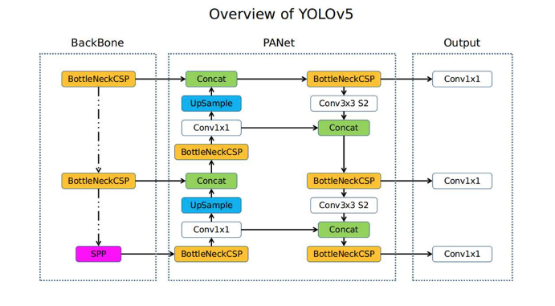
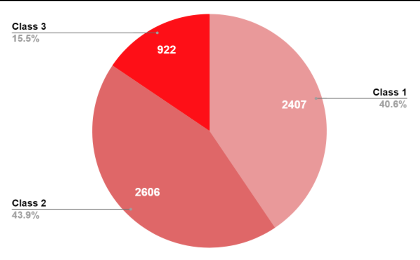
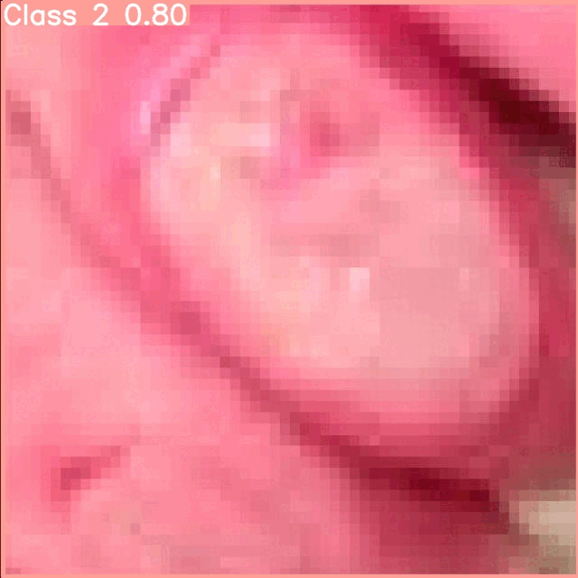

# Skin Burn Detection — YOLOv5s

Real-time burn severity classification using **YOLOv5s** (small variant) trained on a curated medical dataset of 14,044 labeled dermal images across three burn classes.

---

## Table of Contents

- [Overview](#overview)
- [Model Architecture](#model-architecture)
- [Dataset](#dataset)
- [Training Configuration](#training-configuration)
- [Hyperparameters](#hyperparameters)
- [Loss Functions](#loss-functions)
- [Evaluation & Results](#evaluation--results)
- [Inference](#inference)
- [Pipeline](#pipeline)
- [Project Structure](#project-structure)
- [Setup](#setup)
- [Known Limitations](#known-limitations)
- [Future Work](#future-work)
- [Demo](#demo)

---

## Overview

This project fine-tunes **YOLOv5s** with transfer learning for the detection and localization of skin burn injuries. The model identifies bounding boxes around burn regions and classifies them into three severity levels. Dataset annotations were validated by certified medical practitioners and managed via [Roboflow](https://roboflow.com).

| Property | Detail |
|---|---|
| Model | YOLOv5s |
| Backbone | CSP-Darknet53 |
| Parameters | 7,027,720 |
| Total Layers | 214 |
| Input Resolution | 640 × 640 |
| Classes | 3 (Minor, Moderate, Severe) |
| Weights Init | `yolov5s.pt` (COCO pretrained) |
| Training Epochs | 40 |
| Optimizer | SGD |
| Framework | PyTorch |

---

## Model Architecture



YOLOv5s uses a three-stage detection head that operates at three scales, enabling detection of both small and large burn regions within a single frame.

### Backbone — New CSP-Darknet53

The **Cross Stage Partial (CSP)** variant of Darknet53 splits the feature map into two paths at each stage, merging gradient flows to reduce computational redundancy while preserving rich feature representations. It handles multi-resolution feature extraction for varying burn wound sizes.

### Neck — SPPF + New CSP-PAN

- **SPPF (Spatial Pyramid Pooling - Fast):** Aggregates context from multiple receptive field sizes using sequential max-pooling, replacing the original SPP block with a single-kernel equivalent for improved speed.
- **CSP-PAN (Path Aggregation Network):** Bi-directional feature pyramid that fuses high-level semantic information from deep layers with high-resolution spatial detail from shallow layers — critical for precisely localizing burn boundaries.

### Head — YOLOv3 Detection Head

Three decoupled prediction layers output at strides **8**, **16**, and **32**, each predicting:
- Bounding box coordinates `(x, y, w, h)`
- Objectness confidence score
- Per-class probabilities for the 3 burn severity classes

Anchor boxes are pre-assigned per scale using k-means clustering on the dataset.

---

## Dataset

| Metric | Value |
|---|---|
| Curated Source Images | 5,855 |
| Post-Augmentation Total | 14,044 |
| Annotation Tool | Roboflow |
| Label Format | YOLOv5 (normalized XYWH) |
| Validated By | Certified Medical Practitioners |

### Class Distribution



| Class | Label | Count | Share |
|---|---|---|---|
| 1 | Minor Burns | 2,407 | 40.6% |
| 2 | Moderate Burns | 2,606 | 43.9% |
| 3 | Severe Burns | 922 | 15.5% |

> Class 3 (Severe) is underrepresented — a deliberate reflection of real-world incidence rates, though it introduces class imbalance during training.

### Preprocessing

| Step | Detail |
|---|---|
| Auto-Orient | Strip EXIF rotation for consistent spatial alignment |
| Resize | Bilinear interpolation → 640 × 640 |
| Normalization | Pixel values scaled to `[0, 1]` |

### Augmentation (Roboflow + YOLOv5 built-in)

- HSV jitter (hue, saturation, value shifts)
- Horizontal and vertical flips (`fliplr`, `flipud`)
- Random rotation ± 20°
- **Mosaic** — tiles 4 training images into one; improves small-object detection and context diversity
- **Mixup** — blends two images and their labels with a random alpha weight
- **Copy-Paste** — pastes segmentation objects across images; increases class 3 sample exposure

---

## Training Configuration

```bash
python train.py \
  --img 640 \
  --batch 64 \
  --epochs 40 \
  --data /content/datasets/skin-burn-detection-2/data.yaml \
  --weights yolov5s.pt \
  --cache
```

To resume from the best checkpoint:

```bash
python train.py \
  --img 640 \
  --batch 64 \
  --epochs 40 \
  --data /content/datasets/skin-burn-detection-2/data.yaml \
  --weights runs/train/exp/weights/best.pt \
  --cache
```

Monitor training with TensorBoard:

```bash
tensorboard --logdir runs
```

---

## Hyperparameters

| Parameter | Value |
|---|---|
| Learning Rate (`lr0`) | 0.01 |
| Final LR Factor (`lrf`) | 0.01 |
| Momentum | 0.937 |
| Weight Decay | 0.0005 |
| Warmup Epochs | 3.0 |
| Warmup Momentum | 0.8 |
| Warmup Bias LR | 0.1 |
| Box Loss Weight | 0.05 |
| Class Loss Weight | 0.5 |
| Objectness Loss Weight | 1.0 |
| Class PWR Weight | 1.0 |
| Object PWR Weight | 1.0 |

The cosine learning rate schedule decays from `lr0` to `lr0 × lrf` over training, with a linear warmup phase over the first 3 epochs to stabilize early gradient updates.

---

## Loss Functions

YOLOv5 uses a multi-component loss over all three detection scales:

| Component | Function | Purpose |
|---|---|---|
| **Box Loss** | CIoU (Complete IoU) | Regression of bounding box coordinates; accounts for overlap, distance, and aspect ratio |
| **Objectness Loss** | Binary Cross-Entropy with logits | Confidence that an anchor contains an object |
| **Classification Loss** | BCE with logits | Per-class probability for burn severity |

The total loss is a weighted sum:

```
Loss = λ_box × L_box + λ_obj × L_obj + λ_cls × L_cls
```

Positive anchors are matched to ground-truth boxes using an IoU threshold; unmatched anchors contribute only to objectness loss.

---

## Evaluation & Results

**Metrics Used:**

| Metric | Description |
|---|---|
| **Precision** | TP / (TP + FP) — minimizes false burn detections |
| **Recall** | TP / (TP + FN) — critical for medical safety; minimizes missed burns |
| **F1-Score** | Harmonic mean of Precision and Recall |
| **mAP@0.5** | Mean Average Precision at IoU ≥ 0.5 across all classes |
| **mAP@0.5:0.95** | COCO-style mAP averaged over IoU thresholds 0.5–0.95 |

**Confusion Matrix Observations:**

- **Class 1 (Minor):** Best-performing class; strong precision and recall
- **Class 2 (Moderate):** Background images are frequently misclassified as Class 2 — likely due to visual similarity between mild skin inflammation and moderate burns
- **Class 3 (Severe):** Underrepresented in training data; reduced recall expected without data augmentation targeting this class
- **Background FP:** Without background (negative) samples in the dataset, the model occasionally predicts Class 1 on unburnt skin

> The model performs sufficiently well for a baseline at 40 epochs and serves as a strong foundation for clinical tool development.

---

## Inference

Run detection on test images at confidence threshold 0.1:

```bash
python detect.py \
  --weights runs/train/exp/weights/best.pt \
  --img 640 \
  --conf 0.1 \
  --source /path/to/test/images
```

Results are saved to `runs/detect/exp/`. Each output image contains drawn bounding boxes labelled with class name and confidence score (e.g. `Class 2 0.80`).

---

## Pipeline

```
High-Res Dermal Image
        │
        ▼
   Preprocessing
  (Normalize, Resize → 640×640, Auto-Orient)
        │
        ▼
  YOLOv5s Backbone
  (CSP-Darknet53 feature extraction)
        │
        ▼
     SPPF + CSP-PAN Neck
  (Multi-scale feature fusion @ strides 8/16/32)
        │
        ▼
  YOLOv3 Detection Head
  (Bbox regression + objectness + class scores)
        │
        ▼
  NMS (Non-Maximum Suppression)
        │
        ▼
  Output: Burn Region + Severity Class + Confidence
```

---

## Project Structure

```
Skin-Burn-Detection/
├── skin-burn-detection-yolov5.ipynb   # Training & inference notebook
├── EDA.ipynb                          # Exploratory data analysis (template)
├── model_architecture.png             # YOLOv5s architecture diagram
├── dataset_distribution.png           # Class distribution pie chart
├── cover.gif                          # Inference demo animation
├── Skin Burn Detection.docx           # Full technical documentation
└── Skin Burn Detection_Classification.pptx  # Project presentation
```

YOLOv5 source (cloned at runtime):

```
yolov5/
├── train.py           # Training entry point
├── detect.py          # Inference entry point
├── models/
│   └── yolov5s.yaml   # Model architecture definition
├── data/
│   └── hyps/          # Hyperparameter configs
└── runs/
    ├── train/exp/weights/best.pt   # Best checkpoint
    └── detect/exp/                 # Inference outputs
```

---

## Setup

```bash
# 1. Clone YOLOv5
git clone https://github.com/ultralytics/yolov5
cd yolov5
pip install -r requirements.txt

# 2. Install Roboflow
pip install roboflow

# 3. Download dataset
python - <<'EOF'
from roboflow import Roboflow
rf = Roboflow(api_key="YOUR_API_KEY")
project = rf.workspace("anuj-gupta-otilo").project("skin-burn-detection-1cdyv")
dataset = project.version(2).download("yolov5")
EOF

# 4. Train
python train.py --img 640 --batch 64 --epochs 40 \
  --data /path/to/data.yaml --weights yolov5s.pt --cache
```

**Requirements:** Python 3.11+, PyTorch (CUDA recommended), OpenCV, matplotlib, scipy, Pillow

---

## Known Limitations

- Class 3 (Severe Burns) is underrepresented (15.5%) — model recall for severe burns may be lower
- Absence of background (negative) images causes occasional false positives on unburnt skin
- Confidence threshold of 0.1 is intentionally low for medical sensitivity; expect higher FP rate in production
- Dataset sourced primarily via web scraping; distribution may not fully reflect clinical diversity

---

## Future Work

- [ ] Augment Class 3 (Severe Burns) with hospital-sourced imagery
- [ ] Add background/negative samples to reduce false positive rate
- [ ] Extend training to 100+ epochs with learning rate scheduling experiments
- [ ] Evaluate YOLOv8 / YOLOv10 backbones for performance comparison
- [ ] Implement test-time augmentation (TTA) for inference robustness
- [ ] Multi-body-part generalization testing
- [ ] Clinical validation study with controlled hospital deployment
- [ ] Export to ONNX / TensorRT for edge device inference

---

## Demo

> **⚠ GRAPHIC CONTENT WARNING**
> The animation below contains real photographs of skin burn injuries for clinical AI demonstration purposes.
> Viewer discretion is strongly advised. This content is intended for medical and research audiences only.



*Model output: `Class 2 0.80` — Moderate burn detected with 80% confidence. Bounding box drawn around the affected dermal region.*
